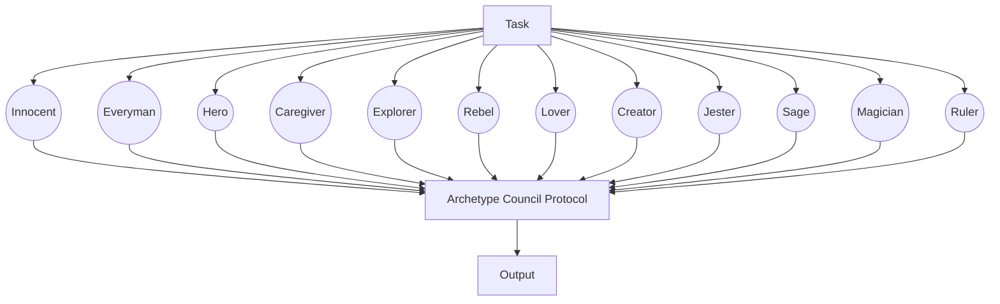

# Jungian Archetypes

To provide a well-rounded, customizable AI agent squad that supports your individual human experience.

## Workflow

1. A trigger occurs (cron, user input, event, etc.)
2. Depending on the trigger:
    a. An individual archetype generates output
    b. Several archetypes generate output
    c. All of the archetypes generate output
    d. A weighted-score summary is generated by the team
3. Depending on the result, the respective output is sent to:
    a. IDE client
    b. Chat client
    c. MCP client

## Team

- Type: RoundRobin
- Termination Condition: Text

## Individuals

## Tools

- MCP Servers
- - Screenpipe
- - Slack
- Local Functions

## Triggers

- Cron
- - 9AM CST
